# **RTB Ingress Benchmark Harness**

A living benchmark harness for RTB-style ingress services across popular backend runtimes and frameworks.

## **Latest Published Benchmark Tops**

This repo is maintained as a living benchmark harness, not a permanent winner board.
Published snapshots are curated on meaningful changes, not emitted on a fixed schedule just to keep the dashboard fresh.

The source of truth for the published dashboard is `site/src/data/site-data.json`.
Local runs under `results/` are scratch data until their snapshot IDs are explicitly promoted through `site/src/data/published-snapshots.json`.

| Mode | Published snapshot | Git SHA | Primary metric | Current published top result |
|------|--------------------|---------|----------------|------------------------------|
| `confirm` | 2026-05-03 (`20260503-003926`, strict-1) | `740d25a` | `req/s / measured stack avg core` | Spring WebFlux, 15015.54 req/s/core |
| `http-only` | 2026-05-03 (`20260503-005939`, fixed-envelope) | `740d25a` | `req/s / measured stack avg core` | Rust / Actix, 38480.29 req/s/core |
| `enqueue` | 2026-05-03 (`20260503-012856`, fixed-envelope) | `740d25a` | `req/s / measured stack avg core` | Rust / Actix, 16677.20 req/s/core |

Latest published `confirm` ranking (`20260503-003926`, strict-1):

| Rank | Service | `req/s / measured stack avg core` | Raw `req/s avg` | p95 avg |
|-----:|---------|----------------------------------:|----------------:|--------:|
| 1 | Spring WebFlux | 15015.54 | 7306.14 | 18.93 ms |
| 2 | Rust / Actix | 13937.31 | 6815.80 | 25.42 ms |
| 3 | Quarkus JVM | 6486.70 | 6131.49 | 28.11 ms |
| 4 | Python / FastAPI | 5960.38 | 6325.54 | 27.02 ms |
| 5 | Go / Gin | 5774.84 | 5731.93 | 31.86 ms |
| 6 | Quarkus Native | 5744.32 | 5385.69 | 30.64 ms |
| 7 | Node / Fastify | 1946.11 | 3348.29 | 51.93 ms |

Published snapshot controls:

- **Workload:** `100` VUs for `30s` with `10s` warmup
- **Budget:** receiver `2.0 CPU / 768m`, Kafka `2.0 CPU / 1g`
- **Strict `confirm`:** `BENCHMARK_PRESET=strict-1`, one HTTP lane, one producer lane, one Kafka partition, topic `bids-strict-1`, retries `0`; excludes `spring-virtual-receiver`
- **`http-only` and `enqueue`:** `BENCHMARK_PRESET=custom`, `BENCHMARK_FAIRNESS_PROFILE=fixed-envelope`, derived parallelism `2`, producer pool `2`, topic `bids` with `3` partitions; includes all 8 receiver lanes
- **Kafka tuning:** `linger=10ms`, `batch=131072`, `request_timeout=5000ms`, `retry_backoff=100ms`; `confirm` uses `acks=1`, `enqueue` uses `acks=0`
- **Promotion gate:** a local result is not dashboard-published unless its ID is listed in `site/src/data/published-snapshots.json`

Current published takeaways:

- In the latest published strict-1 `confirm` run, Spring WebFlux led the primary CPU-normalized result at 15015.54 req/s/core and also led raw throughput at 7306.14 req/s.
- Rust ranked second on CPU-normalized `confirm` throughput at 13937.31 req/s/core and led `confirm` memory-normalized throughput at 11844.60 req/s/GiB.
- In the latest published fixed-envelope `http-only` run, Rust led both CPU-normalized capacity at 38480.29 req/s/core and raw throughput at 26227.59 req/s.
- In the latest published fixed-envelope `enqueue` run, Rust led CPU-normalized capacity at 16677.20 req/s/core; Quarkus JVM led raw throughput at 24915.85 req/s.
- The May 3 published set covers all three modes, but the strict `confirm` row and fixed-envelope `http-only`/`enqueue` rows answer different topology questions, so do not collapse them into one universal winner.
- The Apr 24 local `confirm` run (`20260424-202643`) remains exploratory evidence, not the published baseline.
- Cross-mode rank changes were material once Kafka confirmation stayed in the request path; the published dashboard makes those mode-specific rankings much easier to compare cleanly.
- Raw `req/s avg` is not the primary capacity-planning result. Treat `req/s / measured stack avg core` as the main efficiency ranking, then use raw throughput, memory efficiency, latency, and error rates as guardrails.

Publishing policy:

- Local runs are exploratory by default and should not be treated as published baselines automatically.
- Promote a run only when there is a meaningful trigger such as a major runtime/framework upgrade, a request-path change, a Kafka/client tuning change, a new service, or a benchmark-method change.
- Update the published snapshot only when the result is trusted, comparable enough to interpret, and worth calling out.

For the published snapshot data, see the GitHub Pages dashboard and the committed dashboard data snapshot in `site/src/data/site-data.json`. For the rules behind these runs, see [docs/BENCHMARK_CONTRACT.md](docs/BENCHMARK_CONTRACT.md). For the timeline, local exploratory notes, and publication policy, see [docs/BENCHMARK_HISTORY.md](docs/BENCHMARK_HISTORY.md).

## **1\. Business Case**

In Real-Time Bidding (RTB), latency equals lost revenue. When traffic spikes, we need to spin up new instances instantly.

* **Traditional Java (JVM):** Takes 5-15 seconds to start and "warm up" (JIT compilation). We miss thousands of bid requests during this window.
* **Quarkus Native:** Starts in \<50ms, fully ready to handle peak load. Zero missed revenue during scale-out events.

## **2\. The Scenario**

This service acts as the "Frontline Receiver" for RTB requests.

1. Receives a high-volume stream of POST /bid-request (JSON payloads).
2. Performs fast validation (is the payload malformed? is the device blocked?).
3. Pushes valid requests to a Kafka topic for the complex Decision Engine to process.

## **3\. Real-World Data Sample (OpenRTB Simplified)**

We will perform load testing using realistic, albeit simplified, OpenRTB JSON payloads.

```json
{
  "id": "80ce30c53c16e6ede735f123ef6e32361bfc7b22",
  "at": 1,
  "cur": ["USD"],
  "imp": [
    {
      "id": "1",
      "banner": { "w": 300, "h": 250, "pos": 1 }
    }
  ],
  "site": {
    "id": "102855",
    "domain": "espn.com",
    "cat": ["IAB17"]
  },
  "device": {
    "ua": "Mozilla/5.0 (iPhone; CPU iPhone OS 14_0 like Mac OS X)...",
    "ip": "123.145.167.10",
    "os": "iOS",
    "devicetype": 1
  },
  "user": {
    "id": "55816b39711f9b5acf3b90e313ed29e51665623f"
  }
}
```

[//]: # (## **4\. The "Spike Test" Comparison**)


## **4\. Architecture Overview**

### System Design

```mermaid
graph TB
    subgraph "Load Balancer / Ingress"
        LB[Load Balancer<br/>Port 8070-8078]
    end
    
    subgraph "Receiver Layer - High Throughput HTTP Services"
        QR[Quarkus Receiver JVM<br/>:8070]
        QRN[Quarkus Receiver Native<br/>:8071]
        GR[Go Receiver<br/>:8072]
        RR[Rust Receiver<br/>:8073]
        PR[Python Receiver<br/>:8075]
        SR[Spring Receiver WebFlux<br/>:8076]
        SVR[Spring Receiver VT<br/>:8078]
        NR[Node Receiver<br/>:8077]
    end
    
    subgraph "Message Queue"
        K[Apache Kafka KRaft<br/>Topic: bids<br/>3 partitions<br/>No ZooKeeper!]
    end
    
    subgraph "Stream Processing"
        QS[Quarkus Sinker<br/>:8074<br/>Kafka Streams]
    end
    
    subgraph "Data Storage"
        PG[(PostgreSQL<br/>Database)]
    end
    
    subgraph "Observability Stack"
        P[Prometheus<br/>:9090<br/>Metrics]
        G[Grafana<br/>:3000<br/>Dashboards]
        J[Jaeger<br/>:16686<br/>Distributed Tracing]
    end
    
    subgraph "Management Tools"
        KD[Kafdrop<br/>:9000<br/>Kafka UI]
    end
    
    LB --> QR
    LB --> QRN
    LB --> GR
    LB --> RR
    LB --> PR
    LB --> SR
    LB --> SVR
    LB --> NR
    
    QR -->|Reactive Messaging| K
    QRN -->|Reactive Messaging| K
    GR -->|Kafka Producer| K
    RR -->|Kafka Producer| K
    PR -->|Kafka Producer| K
    SR -->|Kafka Producer| K
    SVR -->|Kafka Producer| K
    NR -->|Kafka Producer| K
    
    K --> QS
    QS -->|Persist| PG
    
    QR -.->|Metrics| P
    QRN -.->|Metrics| P
    GR -.->|Metrics| P
    RR -.->|Metrics| P
    QS -.->|Metrics| P
    
    QR -.->|Traces| J
    QRN -.->|Traces| J
    QS -.->|Traces| J
    
    P --> G
    K -.->|Monitor| KD
    
    style QR fill:#4695eb
    style QRN fill:#4695eb
    style GR fill:#00ADD8
    style RR fill:#f74c00
    style K fill:#231F20
    style QS fill:#4695eb
    style PG fill:#336791
    style P fill:#e6522c
    style G fill:#f46800
    style J fill:#60d0e4
    style KD fill:#0c0c0c
```



### Service Comparison

| Service | Port | Technology | Role |
|---------|------|------------|------|
| **quarkus-receiver** | 8070 | Quarkus JVM + Alpine JRE | JVM receiver baseline |
| **quarkus-receiver-native** | 8071 | Quarkus Native (GraalVM) | Native-image receiver baseline |
| **go-receiver** | 8072 | Go + Gin | Go receiver baseline |
| **rust-receiver** | 8073 | Rust + Actix | Rust receiver baseline |
| **python-receiver** | 8075 | Python + FastAPI | Python receiver baseline |
| **spring-receiver** | 8076 | Spring Boot 4 + WebFlux | Reactive Spring receiver baseline |
| **spring-virtual-receiver** | 8078 | Spring Boot 4 + MVC + virtual threads | Blocking Spring receiver baseline |
| **node-receiver** | 8077 | Node 24 + Fastify | JavaScript/TypeScript receiver baseline |
| **quarkus-sinker** | 8074 | Quarkus JVM + Kafka Streams | Downstream sinker and persistence stage |

**All services are built using multi-stage Dockerfiles** - no pre-build steps required!

## **5\. Quick Start**

### Prerequisites
- Docker & Docker Compose
- 4GB+ RAM recommended

### Build & Run All Services
```bash
# Build all images (includes Maven/Go/Rust compilation inside Docker)
docker-compose build

# Start the entire stack (Kafka, PostgreSQL, receivers, monitoring)
docker-compose up

# Or run specific services
docker-compose up quarkus-receiver kafka postgres
```

### Test the Endpoints
```bash
# Test Quarkus JVM receiver
curl -X POST http://localhost:8070/bid-request \
  -H "Content-Type: application/json" \
  -d '{"id":"test123","at":1,"imp":[{"id":"1"}]}'

# Test Go receiver
curl -X POST http://localhost:8072/bid-request \
  -H "Content-Type: application/json" \
  -d '{"id":"test123","at":1,"imp":[{"id":"1"}]}'
```

### Access Monitoring
- **Kafdrop** (Kafka UI): http://localhost:9000
- **Grafana**: http://localhost:3000
- **Prometheus**: http://localhost:9090

## **6\. Kubernetes Deployment**

This project includes a production-ready Helm chart for deploying to any Kubernetes cluster (local or cloud).

### Prerequisites
- Kubernetes cluster (kind, minikube, EKS, AKS, GKE)
- Helm 3.x
- kubectl configured

### Deploy with Helm

```bash
# Create namespace
kubectl create namespace adtech-demo

# Install the Helm chart
helm install rtb-ingress-benchmark ./helm/rtb-ingress-benchmark \
  --namespace adtech-demo

# Check deployment status
kubectl get pods -n adtech-demo

# Access services (using port-forward for local clusters)
kubectl port-forward -n adtech-demo svc/quarkus-receiver 8070:8070
kubectl port-forward -n adtech-demo svc/prometheus 9090:9090
kubectl port-forward -n adtech-demo svc/grafana 3000:3000
kubectl port-forward -n adtech-demo svc/jaeger 16686:16686
```

### Deploy with ArgoCD (GitOps)

```bash
# Install ArgoCD (if not already installed)
kubectl create namespace argocd
kubectl apply -n argocd -f https://raw.githubusercontent.com/argoproj/argo-cd/stable/manifests/install.yaml

# Create ArgoCD application
kubectl apply -f - <<EOF
apiVersion: argoproj.io/v1alpha1
kind: Application
metadata:
  name: rtb-ingress-benchmark
  namespace: argocd
spec:
  project: default
  source:
    repoURL: https://github.com/dtkmn/rtb-ingress-benchmark
    targetRevision: dev
    path: helm/rtb-ingress-benchmark
  destination:
    server: https://kubernetes.default.svc
    namespace: adtech-demo
  syncPolicy:
    automated:
      prune: true
      selfHeal: true
    syncOptions:
      - CreateNamespace=true
EOF

# Access ArgoCD UI
kubectl port-forward -n argocd svc/argocd-server 8443:443
```

### Local Kubernetes with kind

```bash
# Create kind cluster with port mappings
kind create cluster --name adtech-demo --config kind-config.yaml

# Load local images into kind
kind load docker-image quarkus-receiver:benchmark-local --name adtech-demo
kind load docker-image quarkus-receiver-native:benchmark-local --name adtech-demo
kind load docker-image go-receiver:benchmark-local --name adtech-demo
kind load docker-image rust-receiver:benchmark-local --name adtech-demo
kind load docker-image quarkus-sinker:benchmark-local --name adtech-demo

# Deploy with Helm
helm install rtb-ingress-benchmark ./helm/rtb-ingress-benchmark \
  --namespace adtech-demo --create-namespace
```

### Kubernetes Observability

The Helm chart includes:
- **Prometheus**: Pod-level metrics collection with Kubernetes service discovery
- **Jaeger**: Distributed tracing for request flows (HTTP → Kafka → Database)
- **Health Checks**: Liveness and readiness probes for all services
- **Resource Limits**: CPU and memory limits configured for production

Access Jaeger UI:
```bash
kubectl port-forward -n adtech-demo svc/jaeger 16686:16686
# Open http://localhost:16686
```

### Cloud Deployment Notes

For deploying to cloud Kubernetes (EKS, AKS, GKE):

1. **Push images to a container registry**:
   ```bash
   GIT_SHA=$(git rev-parse --short HEAD)
   docker tag quarkus-receiver:benchmark-local your-registry.io/quarkus-receiver:${GIT_SHA}
   docker push your-registry.io/quarkus-receiver:${GIT_SHA}
   ```

2. **Update `values.yaml`**:
   ```yaml
   serviceType: LoadBalancer  # or use Ingress
   applicationImagePullPolicy: IfNotPresent
   quarkusReceiver:
     image: your-registry.io/quarkus-receiver:abc1234
   ```

3. **Use managed services** (optional):
   - AWS MSK (Managed Kafka) instead of in-cluster Kafka
   - AWS RDS (PostgreSQL) instead of in-cluster database
   - AWS Managed Prometheus & Grafana

## **7\. Benchmark Foundation**

This repository is maintained as a living comparison harness. Historical winners in old benchmark runs should be treated as dated unless they are tied to a specific commit, hardware profile, and benchmark mode.

The benchmark contract lives in [docs/BENCHMARK_CONTRACT.md](docs/BENCHMARK_CONTRACT.md). The default comparison mode is now:

- `BENCHMARK_PRESET=strict-1`
- `BENCHMARK_DELIVERY_MODE=confirm`
- `BENCHMARK_KAFKA_ACKS=1`

That makes the out-of-the-box run compare HTTP request handling plus Kafka delivery confirmation with one HTTP execution lane, one producer lane, one Kafka partition, and no filtered traffic. The strict preset uses only lanes that can satisfy that topology cleanly and defaults to the isolated Kafka topic `bids-strict-1`.

For framework-only cost, run `BENCHMARK_PRESET=custom BENCHMARK_DELIVERY_MODE=http-only`. That mode skips Kafka startup and measures HTTP parsing, validation, filtering, and response handling only.

## **8\. Load Testing**

Run a single target manually:

```bash
BASE_URL=http://localhost:8070 VUS=100 DURATION=30s k6 run k6/load-test.js
BASE_URL=http://localhost:8072 RATE=5000 DURATION=30s PREALLOCATED_VUS=200 MAX_VUS=400 k6 run k6/load-test.js
```

Run the strict-compatible cross-service `confirm` matrix with the reproducible wrapper:

```bash
scripts/run-benchmark-matrix.sh
```

That is equivalent to:

```bash
BENCHMARK_PRESET=strict-1 scripts/run-benchmark-matrix.sh
```

Run fire-and-forget mode explicitly:

```bash
BENCHMARK_PRESET=custom BENCHMARK_DELIVERY_MODE=enqueue scripts/run-benchmark-matrix.sh
```

`enqueue` now defaults `BENCHMARK_KAFKA_ACKS` to `0` unless you override it explicitly.

Run the pure receiver path without Kafka:

```bash
BENCHMARK_PRESET=custom BENCHMARK_DELIVERY_MODE=http-only scripts/run-benchmark-matrix.sh
```

Override the default resource budget explicitly when needed:

```bash
BENCHMARK_RECEIVER_CPUS=1.5 BENCHMARK_RECEIVER_MEMORY=512m \
BENCHMARK_KAFKA_CPUS=1.0 BENCHMARK_KAFKA_MEMORY=768m \
scripts/run-benchmark-matrix.sh
```

Make concurrency explicit when you want to compare scheduler behavior instead of framework defaults:

```bash
BENCHMARK_PRESET=custom \
BENCHMARK_FAIRNESS_PROFILE=fixed-envelope \
BENCHMARK_ENFORCE_PYTHON_RUST_CONFIRM_PARITY=0 \
HTTP_SERVER_WORKERS=2 \
GOMAXPROCS=2 \
QUARKUS_HTTP_IO_THREADS=2 \
scripts/run-benchmark-matrix.sh
```

`HTTP_SERVER_WORKERS` is not a literal CPU-thread knob across the whole matrix. In this repo it means worker processes for Python and Node, worker threads for Rust, and Reactor Netty I/O workers for Spring WebFlux. `BENCHMARK_RECEIVER_CPUS` is the actual container CPU budget.

`spring-virtual-receiver` enables Spring Boot virtual threads, so Spring's own pool-size properties are intentionally not used there. That lane is constrained by the container CPU budget rather than an explicit server worker-count setting.

The matrix defaults to `BENCHMARK_PRESET=strict-1`, which pins the `confirm` path to one HTTP lane where the runtime exposes it, one producer lane, one Kafka partition, an isolated `bids-strict-1` topic, and no fixed retry-count advantage for lanes whose clients expose retry counts. That is the right default if you intend to compare throughput directly.

For the same strict preset explicitly:

```bash
BENCHMARK_PRESET=strict-1 scripts/run-benchmark-matrix.sh
```

The strict preset excludes `spring-virtual-receiver` because virtual threads cannot be cleanly reduced to one HTTP execution lane. If you explicitly add that lane under `BENCHMARK_PRESET=strict-1`, the script fails before building receivers.

`fixed-envelope` is still available when you want a deployment-shape experiment: every receiver gets the same CPU and memory budget, but runtime and producer topology can differ. In that profile, the matrix script defaults `BENCHMARK_KAFKA_PRODUCER_POOL_SIZE=2`, so Java and Rust expose two producer lanes by default; Python and Node get two process-local Kafka producers when `HTTP_SERVER_WORKERS=2`; Go currently uses one process-level writer. Treat that as resource-envelope data, not pure language speed.

```bash
BENCHMARK_PRESET=custom \
BENCHMARK_FAIRNESS_PROFILE=fixed-envelope \
BENCHMARK_ENFORCE_PYTHON_RUST_CONFIRM_PARITY=0 \
scripts/run-benchmark-matrix.sh
```

For Java-focused `confirm` experiments, keep producer lanes explicit in the command you publish:

```bash
BENCHMARK_PRESET=custom \
BENCHMARK_SERVICES="quarkus-receiver spring-receiver spring-virtual-receiver" \
BENCHMARK_KAFKA_PRODUCER_POOL_SIZE=2 \
REPEATS=3 \
scripts/run-benchmark-matrix.sh
```

Keep Kafka producer tuning aligned too:

```bash
BENCHMARK_KAFKA_LINGER_MS=10 \
BENCHMARK_KAFKA_BATCH_BYTES=131072 \
BENCHMARK_KAFKA_REQUEST_TIMEOUT_MS=5000 \
BENCHMARK_KAFKA_RETRY_BACKOFF_MS=100 \
scripts/run-benchmark-matrix.sh
```

For clients that expose it, you can also make retry behavior explicit:

```bash
BENCHMARK_PRESET=custom \
BENCHMARK_FAIRNESS_PROFILE=fixed-envelope \
BENCHMARK_ENFORCE_PYTHON_RUST_CONFIRM_PARITY=0 \
BENCHMARK_KAFKA_RETRIES=5 \
BENCHMARK_KAFKA_RETRY_BACKOFF_MS=100 \
scripts/run-benchmark-matrix.sh
```

Not every client library exposes identical producer knobs. The Java, Go, Rust, and Spring lanes support explicit retry count and retry backoff; `aiokafka` exposes retry backoff but not a fixed retry-count knob, so its retry budget is still bounded by `BENCHMARK_KAFKA_REQUEST_TIMEOUT_MS`. KafkaJS can apply the shared request timeout and retry settings, but its batching model is not a one-to-one match.

See the [Fairness Profiles](docs/BENCHMARK_CONTRACT.md#fairness-profiles), [Kafka Publish Mechanics By Lane](docs/BENCHMARK_CONTRACT.md#kafka-publish-mechanics-by-lane), and [HTTP Execution Model By Lane](docs/BENCHMARK_CONTRACT.md#http-execution-model-by-lane) sections before drawing conclusions from `confirm` mode. No lane performs manual app-level multi-request Kafka batching, and the services do not share one common async/blocking execution model.

The local Kafka broker is now more explicit too:

- topic auto-creation is disabled
- topic partitions, retention, max message size, and min ISR are configurable
- broker network and I/O thread counts are explicit

This is still a single-broker local stack, so it is not true high availability. Real durability improvements require a multi-broker cluster with replication factor greater than `1`.

Each matrix run now produces collated artifacts under `results/<timestamp>/`, including `runs.csv`, `summary.csv`, `summary.md`, `summary.json`, and `mode-comparison.csv` when a compatible opposite-mode run is available.

`summary.md` now includes normalized efficiency views alongside raw throughput, plus a matched HTTP-vs-Kafka delta section when the collator can pair the run with a compatible `http-only` or Kafka-enabled counterpart:

- `req/s / receiver CPU limit`
- `req/s / receiver GiB limit`
- `req/s / measured stack avg core`
- `req/s / measured stack avg GiB`
- estimated Kafka-added latency per service

Read the result tables in this order:

1. `req/s / measured stack avg core` is the primary result for cost-efficient capacity. It answers how much useful throughput the measured receiver+Kafka stack produced per average CPU core it actually consumed.
2. `req/s avg` is the raw throughput sanity check. A service can win this by burning more CPU, so do not treat it as the whole story.
3. `req/s / measured stack avg GiB` is the memory-density check. It matters when instance packing, memory limits, or container density are part of the decision.
4. p95/p99 latency and non-2xx/non-204 responses are veto metrics. A CPU-efficient result with bad tail latency or errors is not a win.

To keep the README readable, only the latest verified baseline snapshot should live near the top of this file. Put monthly updates and historical snapshots in [docs/BENCHMARK_HISTORY.md](docs/BENCHMARK_HISTORY.md).

The repo also ships a static GitHub Pages dashboard under `site/`. Build the dashboard from the committed published data with:

```bash
python3 scripts/build_benchmark_site.py
python3 -m http.server -d site/dist 8000
```

To publish a trusted result, first add its exact result directory ID to `site/src/data/published-snapshots.json`, then refresh the committed data snapshot:

```bash
BENCHMARK_SITE_REFRESH_DATA=1 python3 scripts/build_benchmark_site.py
```

The generator intentionally ignores unlisted local result directories when refreshing published data. The generated Pages artifact lives in `site/dist/`, while the committed dashboard data snapshot is `site/src/data/site-data.json`.

## **9\. Docker Image Optimization**

All services use optimized, multi-stage Dockerfiles:

- **Build stage**: Compiles the application (Maven/Go/Rust)
- **Runtime stage**: Minimal Alpine-based images with only runtime dependencies
- **No pre-build required**: `docker-compose build` handles everything

### Image Size Comparison
- **Go receiver**: 51.6 MB (Alpine + compiled binary)
- **Rust receiver**: 132 MB (Debian Slim + compiled binary)
- **Quarkus Native**: 271 MB (UBI Minimal + native executable)
- **Quarkus JVM**: 387 MB (Alpine + Temurin JRE 21)
- **Quarkus Sinker**: 582 MB (Alpine + Temurin JRE 21 + larger dependencies)

## **10\. Development**

### Local Development (without Docker)

For Quarkus services:
```bash
cd services/quarkus-receiver
./mvnw quarkus:dev  # Hot reload enabled
```

For Go service:
```bash
cd services/go-receiver
go run cmd/receiver/main.go
```

For Rust service:
```bash
cd services/rust-receiver
cargo run
```

For Python service:
```bash
cd services/python-receiver
python3 -m venv .venv
source .venv/bin/activate
pip install -r requirements-dev.txt
uvicorn app.main:app --host 0.0.0.0 --port 8080 --workers 2
```

For Spring Boot service:
```bash
cd services/spring-receiver
mvn spring-boot:run
```

For Node service:
```bash
cd services/node-receiver
npm install
HTTP_SERVER_WORKERS=2 npm start
```

### Rebuild Individual Services
```bash
docker-compose build quarkus-receiver
docker-compose build go-receiver
docker-compose build python-receiver
docker-compose build spring-receiver
docker-compose build node-receiver
```

## **11\. CI/CD**

GitHub Actions workflow automatically builds and pushes all service images to GitHub Container Registry on every push to `main`. No pre-build steps needed - the multi-stage Dockerfiles handle everything!

---

*Benchmark disclaimers: Results based on M-series Mac with Docker Desktop. Production results may vary.*
